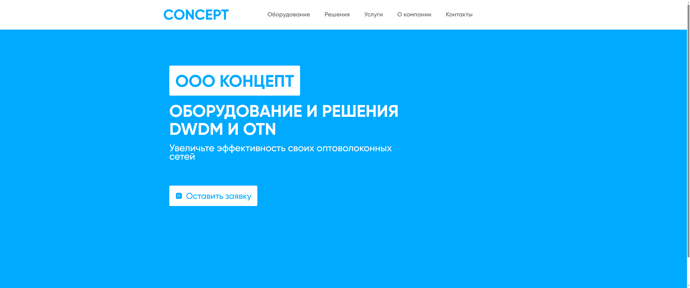
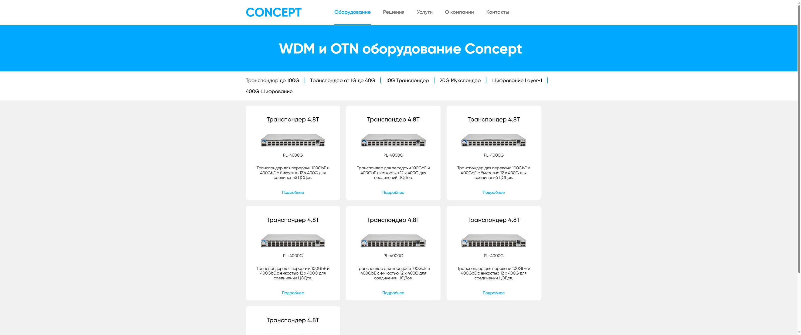
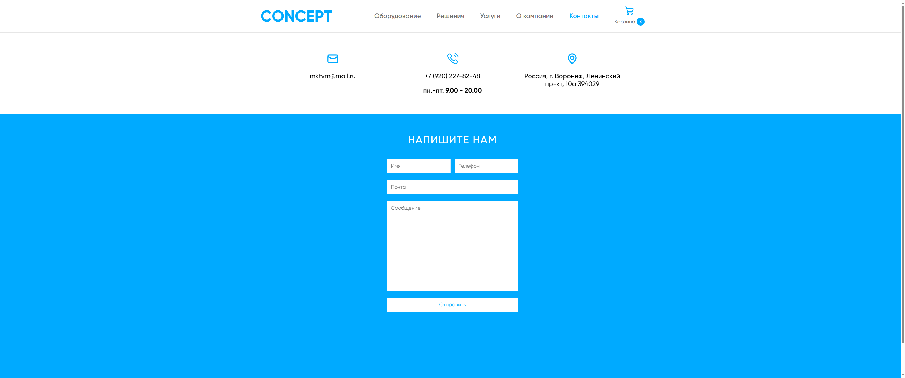
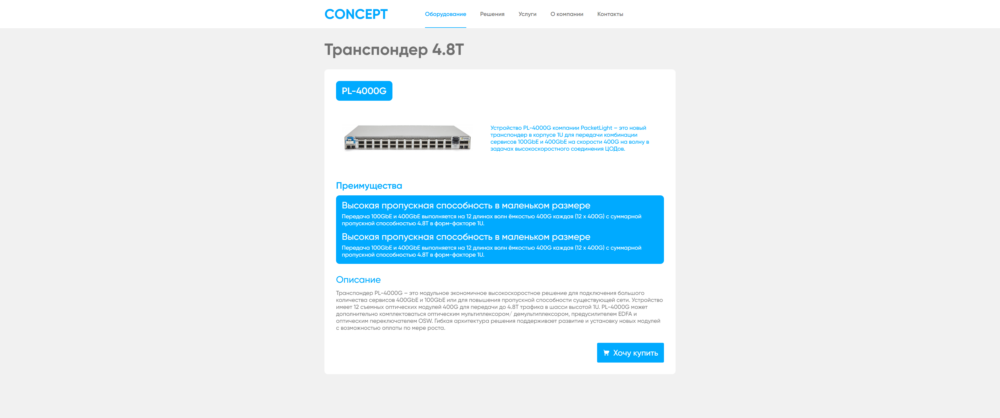
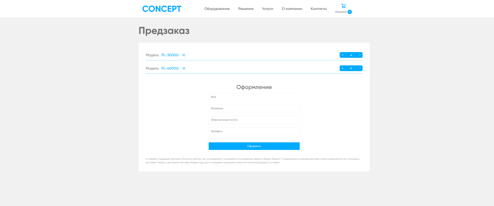
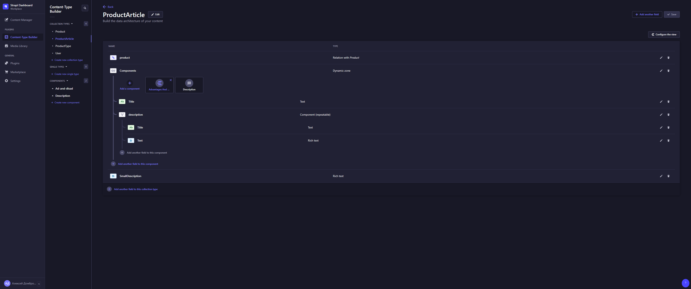

<h1>Concept Products WebSite</h1>
<ul>
    <li>React.ts</li>
    <li>Future Sliced Design</li>
    <li>Styled-components</li>
    <li>React-Router-Dom</li>
    <li>Redux toolkit</li>
    <li>RTK Query</li>
    <li>react-hook-form</li>
    <li>Strapi CMS</li>
</ul>
<h2>Screenshots</h2>
<h4>Main</h4>

<h4>Products</h4>

<h4>Contacts</h4>

<h4>Product Article</h4>

<h4>My Cart</h4>

<h2>Content Manager</h2>
<h4>Types</h4>

